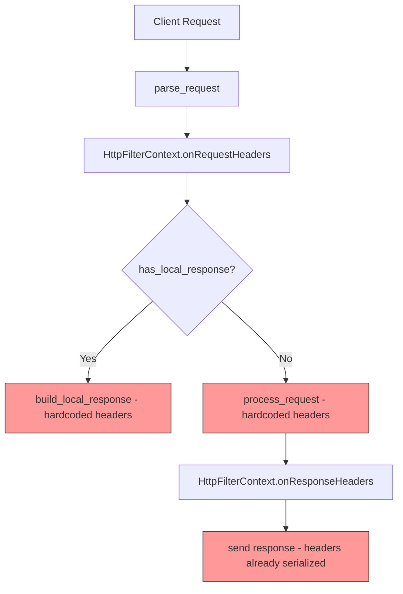
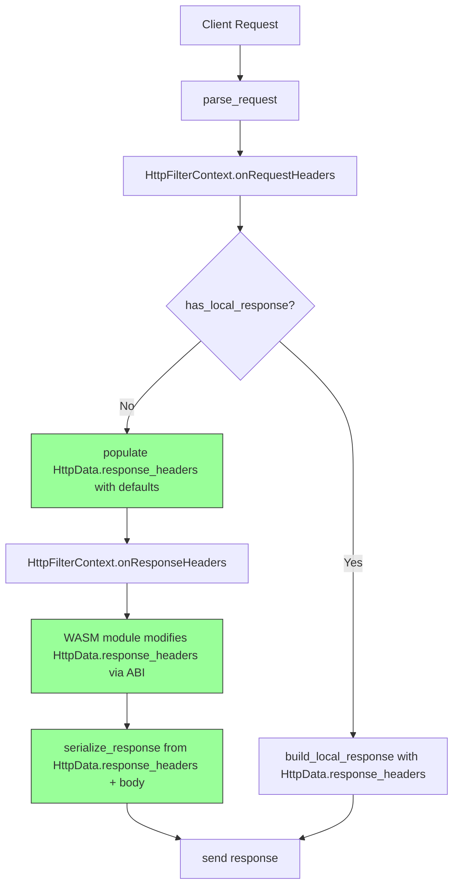
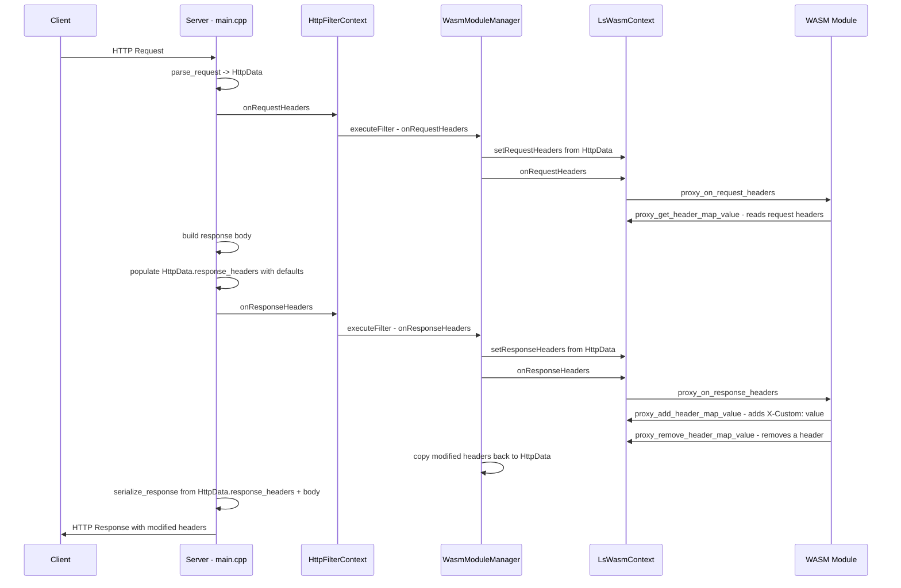

# Plan: Response Header Manipulation from WASM Modules

## Problem Statement

WASM filter modules currently cannot add, replace, or remove HTTP response headers. The proxy-wasm ABI defines header map operations (`proxy_add_header_map_value`, `proxy_get_header_map_value`, `proxy_replace_header_map_value`, `proxy_remove_header_map_value`, etc.) but `LsWasmContext` inherits the default `unimplemented()` stubs from `ContextBase`. Additionally, the response serialization in `main.cpp` builds headers directly without consulting `HttpData::response_headers`.

## Current State



### Key Issues

1. **`LsWasmContext`** (in `src/wasm_module_manager.h:52`) inherits `ContextBase` which returns `unimplemented()` for all 7 header map methods
2. **`HttpData::response_headers`** (in `src/http_filter.h:20`) exists as a `std::map` but is never populated or read
3. **`process_request()`** (in `src/main.cpp:428`) and **`build_local_response()`** (in `src/main.cpp:416`) hardcode `Content-Type`, `Connection`, and `X-Powered-By` headers
4. **Response is built before `onResponseHeaders`** runs (in `src/main.cpp:369-373`), so even if the WASM module could modify headers, the response is already serialized

## Proposed Architecture



## Implementation Steps

### Step 1: Add header storage to LsWasmContext

**File:** `src/wasm_module_manager.h`

Add per-request header maps to `LsWasmContext` to store request and response headers that the WASM module can read and modify:

```cpp
private:
  // Header maps keyed by WasmHeaderMapType
  std::map<proxy_wasm::WasmHeaderMapType, proxy_wasm::Pairs> header_maps_;
```

### Step 2: Override header map methods in LsWasmContext

**File:** `src/wasm_module_manager.h`

Override all 7 header map methods from `ContextBase`:

- `getHeaderMapValue()` — look up a key in the appropriate header map
- `addHeaderMapValue()` — append a key-value pair
- `replaceHeaderMapValue()` — replace an existing key or add if missing
- `removeHeaderMapValue()` — remove a key
- `getHeaderMapPairs()` — return all pairs for a given map type
- `setHeaderMapPairs()` — replace all pairs for a given map type
- `getHeaderMapSize()` — return the number of pairs

These should operate on the internal `header_maps_` storage, dispatching on `WasmHeaderMapType` to handle `RequestHeaders`, `ResponseHeaders`, `RequestTrailers`, `ResponseTrailers`, and gRPC metadata types.

### Step 3: Populate request headers before filter execution

**File:** `src/wasm_module_manager.cc` (in `executeFilter`)

Before calling `onRequestHeaders`, copy `HttpData::request_headers` into the `LsWasmContext` header map so the WASM module can read them via `proxy_get_header_map_value`. This requires passing `HttpData*` to the context or to `WasmModuleManager::executeFilter`.

Add a method to `LsWasmContext`:
```cpp
void setRequestHeaders(const std::map<std::string, std::string>& headers);
```

And call it in `executeFilter` before `onRequestHeaders`.

### Step 4: Populate default response headers before onResponseHeaders

**File:** `src/main.cpp`

Refactor `handle_client_data()` to:
1. Build the response body first via `process_request_body()` — a new helper that returns just the body string
2. Populate `HttpData::response_headers` with default headers: `Content-Type: text/plain`, `Connection: close`, `Content-Length: <body_len>`
3. Then run `filter_ctx.onResponseHeaders()` — which invokes the WASM module, allowing it to modify `response_headers`
4. After the filter chain, serialize the final response from `HttpData::response_headers` + body

### Step 5: Extract modified response headers after filter execution

**File:** `src/wasm_module_manager.h` / `src/wasm_module_manager.cc`

Add a method to `WasmModuleManager` to retrieve the response headers after filter execution:

```cpp
std::vector<std::pair<std::string, std::string>> getResponseHeaders(const std::string& module_name) const;
```

Or alternatively, have `HttpFilterContext::onResponseHeaders()` pull the modified headers back from the WASM context into `HttpData::response_headers` after each module runs.

### Step 6: Refactor response serialization

**File:** `src/main.cpp`

Create a new `serialize_response()` function that builds the HTTP response from `HttpData`:

```cpp
std::string serialize_response(const HttpData& http_data, const std::string& body) {
    std::ostringstream response;
    response << "HTTP/1.1 200 OK\r\n";
    for (const auto& [key, value] : http_data.response_headers) {
        response << key << ": " << value << "\r\n";
    }
    response << "\r\n";
    response << body;
    return response.str();
}
```

Also update `build_local_response()` to merge `sendLocalResponse` additional_headers into `HttpData::response_headers`.

### Step 7: Wire sendLocalResponse additional_headers

**File:** `src/wasm_module_manager.h`

The existing `sendLocalResponse()` override already receives `additional_headers` but discards them. Store them and expose them so `build_local_response()` can include them.

### Step 8: Update sample filter to demonstrate response header manipulation

**File:** `samples/sample_filter.c`

Add an `onResponseHeaders` handler to the sample filter that adds a custom response header, e.g., `X-Wasm-Filter: active`, to demonstrate the feature works end-to-end.

### Step 9: Update README

**File:** `README.md`

- Mark the TODO item as complete: `[x] Response header manipulation from WASM modules`
- Update the Features section to mention response header manipulation
- Add a usage example showing a WASM filter that modifies response headers

## Data Flow Summary



## Files Modified

| File | Changes |
|------|---------|
| `src/wasm_module_manager.h` | Add header map storage and override 7 header map methods in LsWasmContext; store sendLocalResponse additional_headers |
| `src/wasm_module_manager.cc` | Populate context headers before filter execution; extract modified headers after execution |
| `src/http_filter.h` | Update HttpFilterContext to sync headers between HttpData and WasmModuleManager |
| `src/main.cpp` | Refactor response building: separate body generation from header serialization; use HttpData.response_headers |
| `samples/sample_filter.c` | Add onResponseHeaders handler demonstrating header manipulation |
| `README.md` | Mark TODO complete, update features and examples |

## Risks and Considerations

- **Header ordering**: `std::map` sorts alphabetically. HTTP headers are order-sensitive in some edge cases. Consider using `std::vector<std::pair<std::string, std::string>>` instead of `std::map` for `response_headers` to preserve insertion order.
- **Multi-value headers**: HTTP allows multiple values for the same header name. The current `std::map<std::string, std::string>` in `HttpData` cannot represent this. The proxy-wasm `Pairs` type is `std::vector<std::pair<std::string, std::string>>` which handles this correctly. Consider changing `HttpData::response_headers` to match.
- **Thread safety**: The current server is single-threaded, so no concurrency concerns.
- **Header lifetime**: `getHeaderMapValue` returns a `std::string_view*`. The backing storage in `LsWasmContext` must outlive the view. Using `Pairs` with owned strings handles this.
