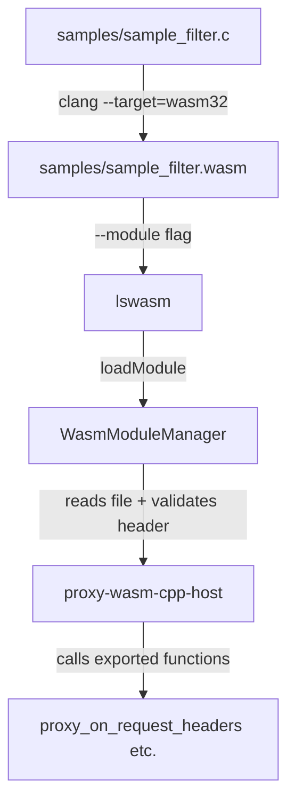

# Plan: Create a Sample WASM Filter for lswasm

## Context

The `lswasm` project is a C++ HTTP proxy server that loads and executes WebAssembly modules using the [proxy-wasm-cpp-host](third_party/proxy-wasm-cpp-host) library. The server accepts WASM filter modules via the `--module` CLI flag, which calls [`WasmModuleManager::loadModule()`](src/wasm_module_manager.cc:7) to read the `.wasm` file and load it into memory.

The proxy-wasm ABI defines a set of **exported functions** that the WASM module must provide, and **imported functions** that the host provides to the module. The host-side code in [`bytecode_util.cc`](third_party/proxy-wasm-cpp-host/src/bytecode_util.cc:25) validates the WASM magic header bytes (`\0asm`) and looks for ABI version exports like `proxy_abi_version_0_2_1`.

## Architecture

## Proxy-Wasm ABI Exports Required

Based on analysis of [`proxy_wasm_intrinsics.cc`](third_party/proxy-wasm-cpp-sdk/proxy_wasm_intrinsics.cc:20), the WASM module must export these functions:

### Required
- `proxy_abi_version_0_2_1` — ABI version marker function (empty body)
- `proxy_on_context_create` — Called when a new context is created
- `proxy_on_vm_start` — Called when the VM starts
- `proxy_on_configure` — Called with plugin configuration
- `proxy_on_done` — Called when processing is complete
- `proxy_on_delete` — Called when context is destroyed
- `proxy_on_log` — Called for logging

### HTTP Filter Callbacks
- `proxy_on_request_headers` — Process request headers
- `proxy_on_request_body` — Process request body
- `proxy_on_response_headers` — Process response headers
- `proxy_on_response_body` — Process response body
- `proxy_on_request_trailers` — Process request trailers
- `proxy_on_response_trailers` — Process response trailers

### Host Imports the Module Can Call
- `proxy_log` — Log a message
- `proxy_get_header_map_pairs` — Get header key-value pairs
- `proxy_set_header_map_pairs` — Set header key-value pairs
- `proxy_get_buffer_bytes` — Get buffer data

## Compilation Approach

Use **clang** with `--target=wasm32-unknown-unknown` to compile a pure C source file into a `.wasm` binary. This avoids the need for Emscripten or Docker.

Key compiler flags:
- `--target=wasm32-unknown-unknown` — Target WebAssembly
- `-nostdlib` — No standard library (freestanding)
- `-Wl,--no-entry` — No `_start` entry point (library module)
- `-Wl,--export-all` — Export all symbols
- `-O2` — Optimization level

## Files to Create

### 1. `samples/sample_filter.c`
A minimal proxy-wasm filter written in C that:
- Exports the ABI version marker `proxy_abi_version_0_2_1`
- Implements all required proxy-wasm callback functions
- Calls `proxy_log` to log messages during request/response processing
- Returns `FilterHeadersStatus::Continue` (value `0`) from header callbacks
- Returns `FilterDataStatus::Continue` (value `0`) from body callbacks

### 2. `samples/Makefile`
Build rules:
- `sample_filter.wasm` target using clang wasm32
- `clean` target
- Configurable `CC` variable (defaults to `clang`)

### 3. `samples/README.md`
Documentation covering:
- What the sample filter does
- Prerequisites (clang with wasm32 support)
- Build instructions
- Usage with lswasm (`./lswasm --module samples/sample_filter.wasm`)

## Execution Plan

1. Create `samples/sample_filter.c` — The C source implementing the proxy-wasm ABI
2. Create `samples/Makefile` — Build system for compiling to `.wasm`
3. Create `samples/README.md` — Documentation
4. Run `make -C samples` to compile the filter
5. Verify the resulting `.wasm` file has valid WASM magic bytes and correct exports
